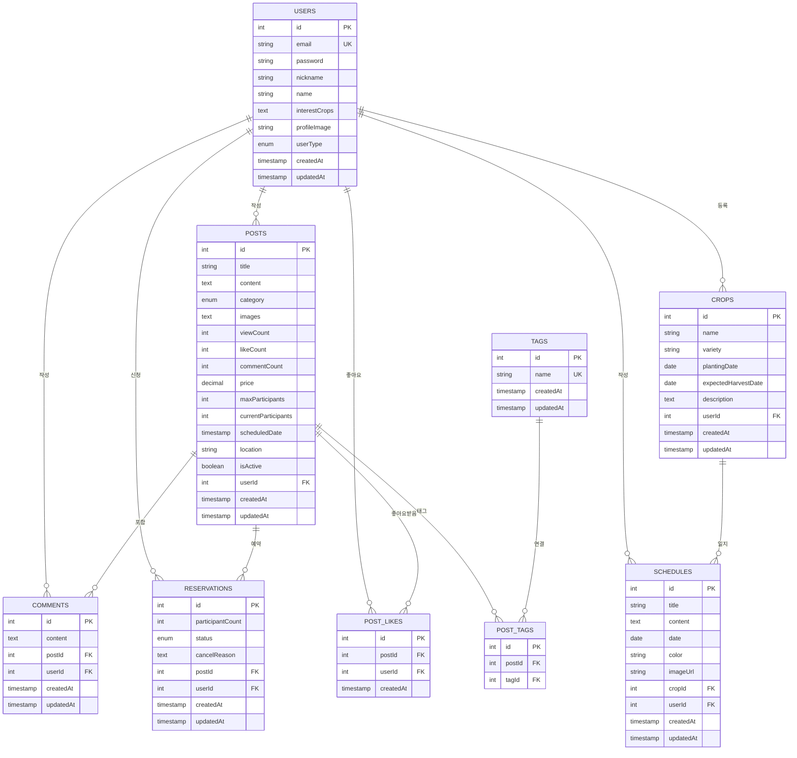

# SmartFarming Database ERD

## 📊 데이터베이스 구조 다이어그램

## 🔗 주요 관계

### 1:N 관계
- **Users ↔ Posts**: 사용자는 여러 게시글 작성
- **Users ↔ Comments**: 사용자는 여러 댓글 작성
- **Users ↔ Crops**: 사용자는 여러 작물 등록
- **Users ↔ Schedules**: 사용자는 여러 일지 작성
- **Users ↔ Reservations**: 사용자는 여러 예약 신청
- **Posts ↔ Comments**: 게시글은 여러 댓글 포함
- **Posts ↔ Reservations**: 게시글은 여러 예약 접수
- **Crops ↔ Schedules**: 작물은 여러 일지 보유

### N:M 관계 (중간 테이블)
- **Users ↔ Posts**: POST_LIKES (좋아요)
- **Posts ↔ Tags**: POST_TAGS (태그)

## 📋 테이블별 특징

### Users (사용자)
- **Primary Key**: id
- **Unique**: email
- **Enum**: userType (HOBBY, EXPERT, ADMIN)

### Posts (게시글)
- **Categories**: 7가지 (general, question, diary, knowhow, reservation, free, suggestion)
- **특별 필드**: 예약글용 (maxParticipants, scheduledDate, location)
- **통계 필드**: viewCount, likeCount, commentCount

### Reservations (예약)
- **Status**: PENDING, CONFIRMED, CANCELLED, COMPLETED
- **참가자 수**: participantCount

### Schedules (작물일지)
- **날짜 기반**: date 필드로 캘린더 구현
- **색상 코딩**: color 필드 (HEX)
- **이미지**: imageUrl 필드